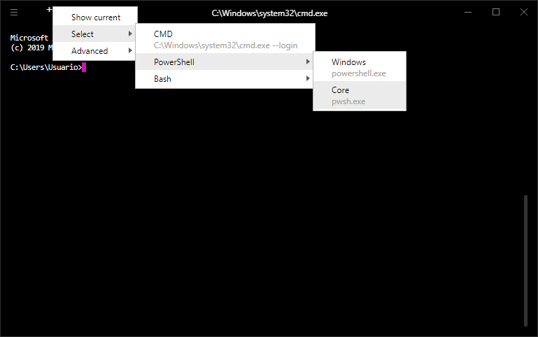

# Hyper Launch Menu

Adds the ability to select (at runtime) the shell to launch on Hyper



## Installation

Run

`hyper i hyper-launch-menu`

Or add `'hyper-launch-menu'` to the list of `plugins` in `.hyper.js`

## Configuration
### Usage:

Add the `shells` key to the `config` object in your `.hyper.js` with a list of shells, e.g.:

```
module.exports = {
  config: {
    // ...

    shells: [
      {
        name: "CMD",
        shell: 'cmd.exe',
        args: ['--login'],
      },
      {
        name: "Bash",
        group: [
          {
            name: "WSL",
            shell: 'C:\\Windows\\System32\\wsl.exe',
            args: ['--login'],
          },
          {
            name: "Git",
            shell: "C:\\Program Files\\Git\\bin\\bash.exe",
            args: ["--login"],
          },
        ],
      },
      {
        name: "Powershell",
        shell: "powershell.exe",
        default: true,
      },
      {
        name: "Cygwin",
        shell: "C:\\cygwin64\\bin\\bash.exe",
        args: ["--login"],
      },
    ],

    // ...
  }
  // ...
}

```
### Shell parameters:
- `name:` The name displayed for this shell in the menu
- `shell:` A path to a custom shell to run when Hyper starts a new session
- `args:` An array of shell arguments *[Optional]*
- `env:` An object of environment variables to set before launching shell *[Optional]*
- `shortcut:` Combined with the global parameter `selectShellKeymap`, binds a keymap to select the shell. This is used to add the last key for your keymap *[Optional]*

### Global parameters:

- `shellName:` Name for the config (vanilla) default shell [Default: `"Default"`]
- `showShellInfo:` If the menu should show info about each shell [Default: `false`]
- `showShellNotifications:` If a notification should popup each time you select a shell [Default: `true`]
- `openOnSelect:` If true, a new tab will be opened whenever you select a shell [Default: `false`]
- `setOnSelect:` If false, the selected shell will only be used the next time you open a shell [Default: `true`]
- `detectShells`: If true, a shells list will be automatically created according to your operating system. [Default: `false`]
- `selectShellKeymap`: Combined with the shell parameter `shortcut`, binds a keymap to select the shell. This is used to add the modifiers of any shell's keymap (i.e: 'ctrl+shift') [Default: `undefined`]

### Features
#### Shell groups
Since version 4.0.0, you can group related shells together.
This allows you to organize your shells list, specially useful if it is a long one.

You can do this by wrapping multiple shells in a "shell group", like this:
```
{
  name: "Bash",
  group: [
    {
      name: "WSL",
      shell: 'C:\\Windows\\System32\\bash.exe',
      args: ['--login']
    },
    {
      name: "Git",
      shell: "C:\\Program Files\\Git\\bin\\bash.exe",
      args: ["--login"]
    },
  ],
},
```
#### Default shell
You can now have your default shell alongside the others inside the `shells` key.

By adding a `default` flag inside the shell object marked as `true`,
the plugin will automatically select it, overriding any shell provided the vanilla way.

(Its name is always defined by its `name` attribute, and not the `shellName` parameter, as that only works for the vanilla one)

Example:
```
{name: "Powershell", shell: "powershell.exe", default: true}
```
Selecting the default shell directly from your shells list lets you more flexibility when changing things.

#### Auto-detect shells
If you dont specify a shells list, but set the `detectShells` flag to true,
it will automatically create a shells list according to your operating system.

Side note: When this is true, the config vanilla `shell` attributes wont be taken into account.

#### Import/Export shells list
This feature is mainly thought to be used alongside the auto-detection.

You can export your current shells configuration to a JSON file (or your clipboard), 
and also import them, in order to try out a configuration without the need of modifying Hyper's config file.

Exporting is useful as JSON format is supported in the `hyper.js` file, so you can directly copy and paste the object into the file
(setting the `shells` property to that object), and have it persistently.